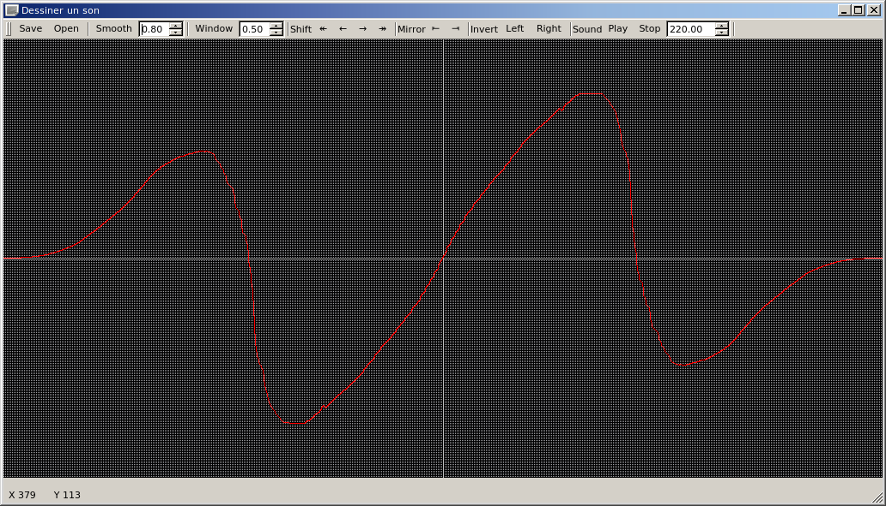

# dessiner-un-son

This is a graphical program to draw waveforms by mouse, which can play back a period of sound while it is edited.

The waves can be imported and exported as wavetables to data files or C++ source.
The author uses this software to experiment various waves with his wavetable synthesizer, but it can surely be extended for more purposes.

For editing, the data is resampled and quantized to screen dimensions. If the user desires more resolution than the default settings provide, currently he must edit manually the variables *gridwidth* and *gridheight* in source code.

## Dependencies

Install the following software packages, on a Debian-style GNU+Linux OS.

`qt5-qmake` `qtbase5-dev-tools` `qtbase5-dev` `qtmultimedia5-dev` `libqt5multimedia5-plugins` `libspeexdsp-dev` `libboost-dev`
